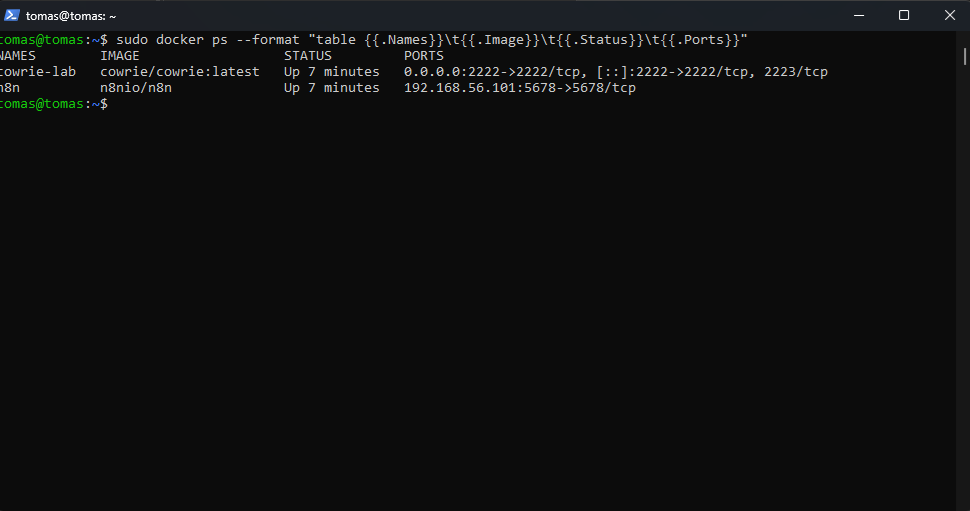
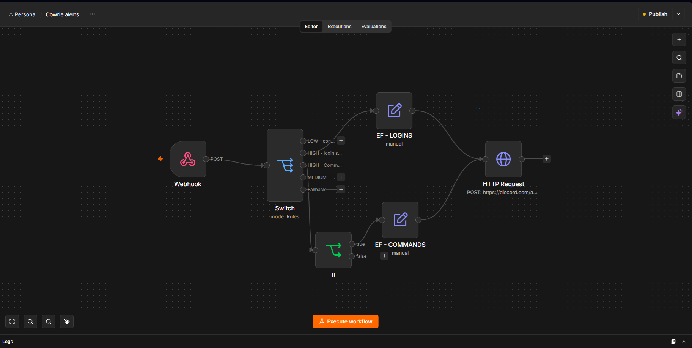
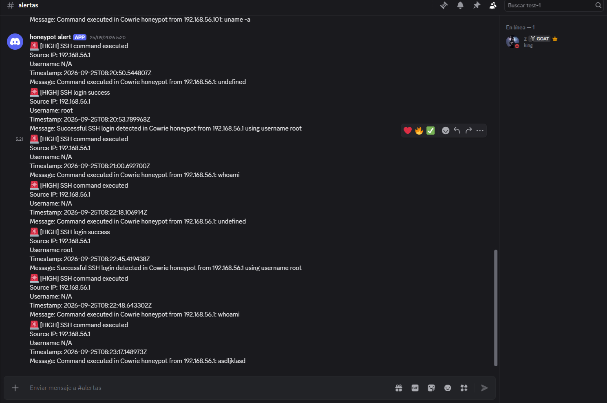
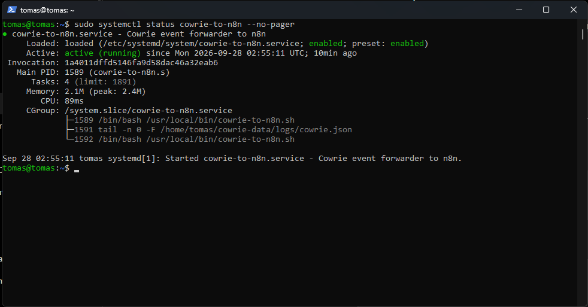
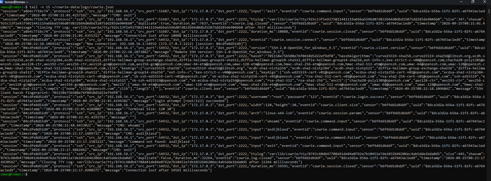

# Cowrie Honeypot SOC Lab

## Overview

This project is a small SOC-oriented lab built to monitor and classify SSH activity using a Cowrie honeypot.

The environment was deployed inside an Ubuntu Server virtual machine using Docker. Cowrie generates structured JSON events, which are forwarded automatically to n8n using a custom systemd service.

n8n classifies relevant events and sends security alerts to Discord through a webhook.

## Architecture

Windows Host  
↓  
Oracle VirtualBox  
↓  
Ubuntu Server VM  
↓  
Docker  
├── Cowrie  
└── n8n  
↓  
cowrie.json  
↓  
systemd event forwarder  
↓  
n8n Webhook  
↓  
Event classification  
↓  
Discord Alerts

## Project Highlights

- Deployed Cowrie and n8n in Docker inside an Ubuntu Server VM.
- Persisted Cowrie JSON logs outside the container.
- Built a systemd event forwarder to send new Cowrie events to n8n automatically.
- Classified SSH login and command events in n8n.
- Filtered low-value commands such as `exit` and `logout`.
- Sent high-severity alerts to Discord using webhooks.
  
## Technologies Used

- Ubuntu Server
- Oracle VirtualBox
- Docker
- Cowrie
- n8n
- systemd
- PowerShell
- SSH
- JSON
- Discord Webhooks

## Event Flow

1. A connection is made to the Cowrie SSH honeypot.
2. Cowrie records the activity in `cowrie.json`.
3. A systemd service monitors the log file for new events.
4. New JSON events are sent to an n8n webhook.
5. n8n classifies events based on their `eventid`.
6. Relevant events are normalized and sent to Discord as alerts.

## Detection Logic

The workflow currently handles the following events:

- `cowrie.login.success` → HIGH severity alert
- `cowrie.command.input` → HIGH severity alert
- `exit` and `logout` commands → filtered to reduce noise
- Other Cowrie events → logged but not sent to Discord

## Security Decisions

- The lab runs inside a virtual machine to isolate it from the Windows host.
- Cowrie and n8n run in Docker containers to simplify deployment and dependency management.
- Cowrie logs are stored outside the container using persistent storage.
- Captured passwords are not forwarded to Discord to avoid unnecessary exposure of sensitive data.
- The honeypot was tested locally and was not exposed directly to the public Internet.

## What I Learned

This project helped me gain hands-on experience with:

- Linux administration
- Docker containers
- SSH services
- Docker networking and port mapping
- Persistent storage and bind mounts
- Linux file permissions
- systemd services
- JSON event processing
- Webhooks
- n8n workflow automation
- Security event classification
- Alerting and noise reduction

## Screenshots

### Docker Services

### n8n Workflow

### Discord Alerts

### systemd Forwarder

### Cowrie JSON Events

